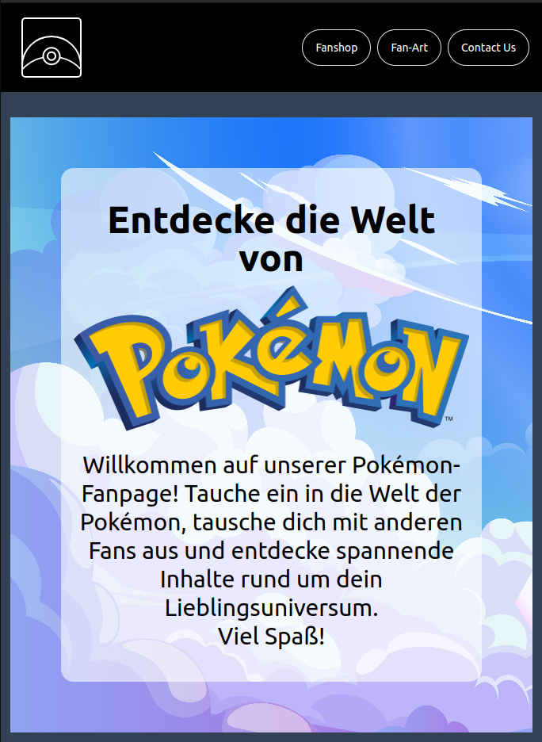
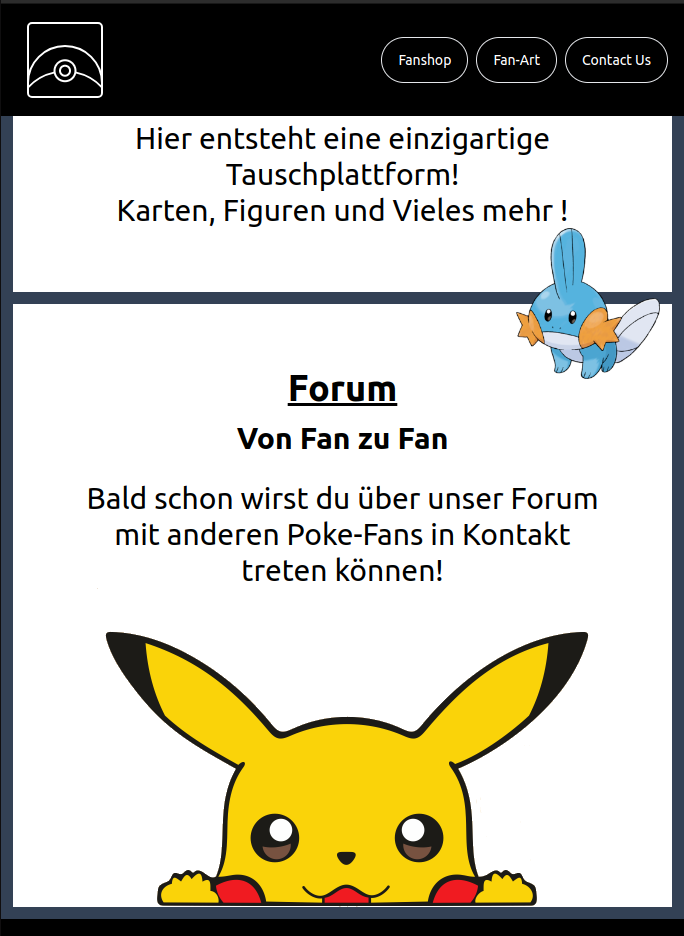
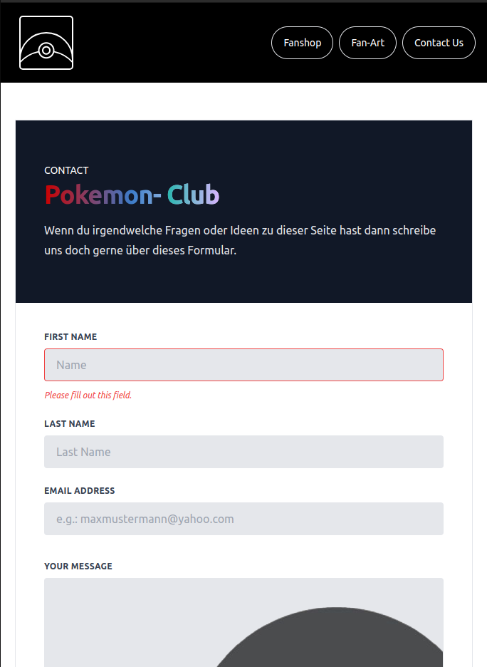
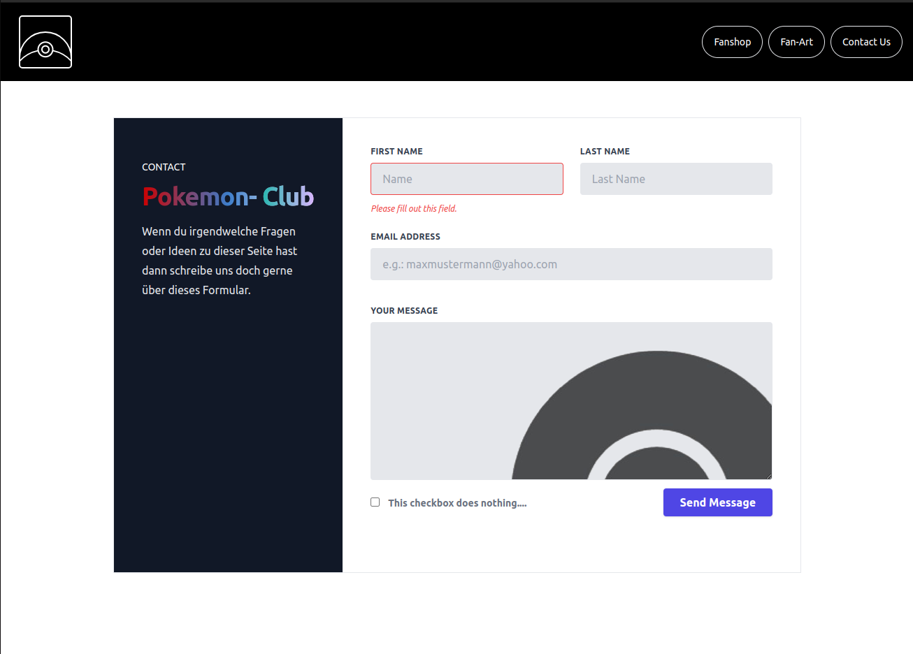

# Pokémon-FanPage - NICHT für den KOMMERZIELLEN GEBRAUCH!

## Beschreibung

>Eine Fan-Club-Website, die es Nutzern ermöglicht, Fan-Art zu durchsuchen, hochzuladen, sich über Neuigkeiten zu informieren und mit anderen Fans zu vernetzen. Erstellt mit Tailwind CSS für modernes, responsives Design.

## Beispiele






--------------------------------------------------------------------------------

**!!!Das Projekt ist ein Projekt an dem gerne mitgearbeitet werden kann!!!!!**
Einfach melden 😄

--------------------------------------------------------------------------------

## Inhaltsverzeichnis

1. [Installation](#installation)
2. [Verwendung](#verwendung)
3. [Features](#features)
4. [Beispiele](#beispiele)
5. [Mitwirken](#mitwirken)
6. [Lizenz](#lizenz)
7. [Autoren](#autoren)
8. [Kontakt](#kontakt)
9. [Danksagungen](#danksagungen)
10. [Changelog](#changelog)
11. [Known Issues/Bugs](#known-issuesbugs)
12. [Roadmap](#roadmap)
13. [Verwandte Projekte](#verwandte-projekte)
14. [Abhängigkeiten](#abhängigkeiten)

## Installation

Diese Anleitung erklärt, wie du das Projekt lokal einrichtest und Tailwind CSS integrierst.

### Voraussetzungen

Stelle sicher, dass die folgenden Programme auf deinem System installiert sind:

- [Node.js](https://nodejs.org/) (Version 12 oder höher empfohlen)
- [npm](https://www.npmjs.com/) (Normalerweise wird npm zusammen mit Node.js installiert)

### Schritt 1: Projekt klonen

Klonen das Repository auf deinen lokalen Rechner:

```bash
git clone https://github.com/username/repo.git
cd repo
```

### Schritt 2: Abhängigkeiten installieren

Installiere die benötigten Node.js-Pakete:

```bash
npm install
```

### Schritt 3: Tailwind CSS einrichten

Tailwind CSS konfigurieren:

```bash
npx tailwindcss init
```

Füge die Tailwind-Direktiven zu deiner CSS-Datei hinzu:

```css
@tailwind base;
@tailwind components;
@tailwind utilities;
```

### Schritt 4: Lokalen Entwicklungsserver starten

Starte den lokalen Entwicklungsserver:

```bash
npm run dev
```

## Verwendung

1. **Fan-Art durchsuchen**: Gehe zur Galerie-Seite, um die hochgeladenen Fan-Artworks zu sehen.
2. **Fan-Art hochladen**: Nutze das Kontakt-Formular, um mit uns in verbindung zu treten.
3. **Neuigkeiten**: Besuche den fan-Shop, welcher nicht von uns ist!
4. **Vernetzen**: Nutze SCHON BALDndie Foren oder Chats, um dich mit anderen Fans auszutauschen.

## Features

- **Kontaktformular**: Ermöglicht es Nutzern, direkt über [Formspree](https://formspree.io/) Kontakt aufzunehmen.
- **Externer Fanshop**: Verlinkt zu einem externen Fanshop für Pokémon-Merchandise.
- **Galerie**: Anzeige und Upload von Fan-Art.
- **Neuigkeiten**: Aktuelle Informationen und Updates über Pokémon.

## Mitwirken

Beiträge sind herzlich willkommen! Bitte folge diesen Schritten, um mitzuwirken:

1. Forke das Repository.
2. Erstelle einen neuen Branch (`git checkout -b feature/deine-funktion`).
3. Committe deine Änderungen (`git commit -am 'Hinzufügen einer neuen Funktion'`).
4. Push den Branch (`git push origin feature/deine-funktion`).
5. Erstelle einen Pull Request.

## Lizenz

Dieses Projekt enhält keine Lizens.

## Autoren

- **Christoph Klemtz** - Web - Softwareentwickler in Ausbildung - [ChristophKlemtz-DCI](https://github.com/ChristophKlemtz-DCI)


## Kontakt

Bei Fragen oder Anmerkungen, kannst du uns erreichen:

- **E-Mail**: kontakt@example.com
- **GitHub Issues**: [GitHub Issues](https://github.com/username/repo/issues)

## Danksagungen

- [Tailwind CSS](https://tailwindcss.com/) für das fantastische CSS-Framework.
- [Pokémon Company](https://www.pokemon.com/) für die inspirierende Welt der Pokémon.

## Changelog

- **v1.0.0** - Initiale Veröffentlichung

## Known Issues/Bugs

- In der fan-Art Gallery funktioniert das Grid-layout noch nicht
- mit JS kommen in Zukunft noch mehr features hinzu 

## Roadmap

- **v1.1.2**: Hinzufügen eines Benutzerprofils/Verbesserung der Oberfläche
- **v1.2.0**: Integration eines Foren-Systems
- **v1.2.2**: Integration eines Upload-Systems für Fan-Art


## Verwandte Projekte

- [Pokémon-Datenbank](https://github.com/username/pokemon-database)
- [Pokémon-Wiki](https://github.com/username/pokemon-wiki)


## Abhängigkeiten

- [Tailwind CSS](https://tailwindcss.com/)
- [Formspree](https://formspree.io/)
- [Jest](https://jestjs.io/)
